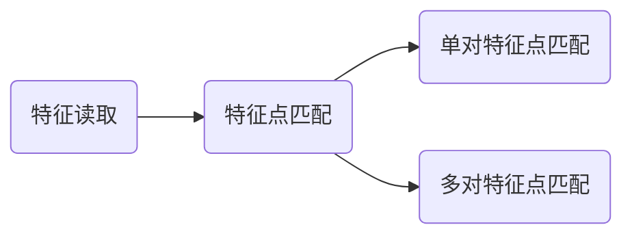

# 衍射图像特征提取的技术思路
## 1.基于openCV的SIFT提取技术
```
https://github.com/opencv/opencv-python
```
### SIFT特征提取

- 单对特征点匹配：匹配所有特征点
- 多对特征点匹配：一次匹配k个和原图最相近的特征点，当k个点和原图统一特征点的欧式距离差距在某一范围时，才认为这是一个原图的特征点的相似点

### 调优思路
- 采样点数目调优
- k点对筛选调优
- 选取特征明显的衍射图样

## 2. Facebook开源的detectron2
> detectron2是在2020年左右SOTA的一个特征识别模型，有很多预训练模型的加持，可调参数多
```
https://github.com/facebookresearch/detectron2
```
```
Model Zoo
https://github.com/facebookresearch/detectron2/blob/main/MODEL_ZOO.md

查看模型对应的Key
https://github.com/facebookresearch/detectron2/blob/main/detectron2/model_zoo/model_zoo.py
```

### 标注数据格式
Detectron2接受COCO格式的数据集
```json
[
    {
        "image_id":0,
        "file_name":"101.jpeg",
        "height":500,
        "width":500,
        "annotations":[
            {
                "bbox":[
                    100,
                    100,
                    50,
                    50
                ],
                "bbox_mode":1,
                "category_id":"0"
            }
        ]
    }
]
```
在代码中有如下一行：
```python
j["bbox_mode"] = BoxMode.XYWH_ABS
```
XYWH代表我们用标注左上角的X、Y坐标和标注长宽来代表一个标注块

### 训练过程
参考代码中的参数
命令行中使用下面的指令来查看进度
```
$ load_ext tensorboard
$ tensorboard --logdir output
```

## 3.YOLOv8特征识别
> YOLOv8在2月份发布之后目前已经在特征识别领域达到SOTA
```
https://github.com/ultralytics/ultralytics
```

新版YOLOv8支持了命令行检测和训练指令：
```shell
预测：
yolo predict model=yolov8n.pt source='https://ultralytics.com/images/bus.jpg'
```

```shell
训练：
yolo task=detect \mode=train \model=yolov8s.pt \data=./v8data/data.yaml \epochs=100 \imgsz=640
```

## 4.特征标注
> 目前对特征标注支持比较好的是roboflow制作的在线标注网站，可以在网站上生成需要格式的标注文件
```
https://app.roboflow.com/
```